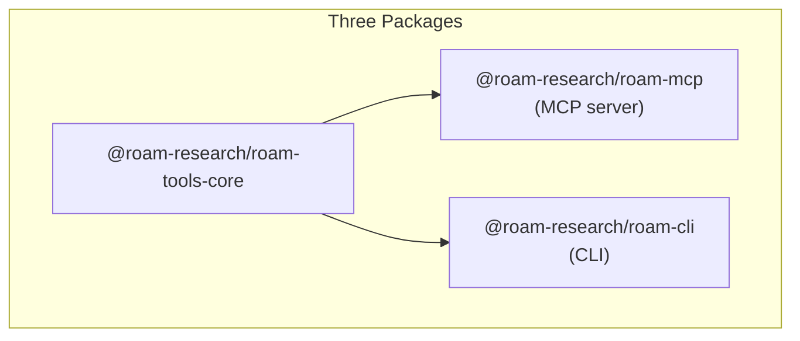
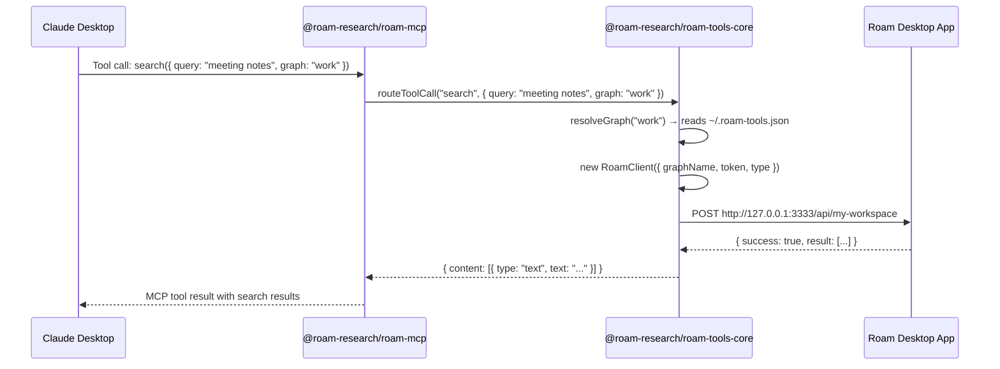

# npm Packaging Design

## What This Repository Contains

This is a monorepo with three packages that share a common core:

1. **MCP Server** (`packages/mcp/`) — A Model Context Protocol server that communicates over stdio. MCP clients (Claude Desktop, Cursor, etc.) launch this process and talk to it via stdin/stdout. It exposes Roam Research operations as MCP tools.

2. **CLI** (`packages/cli/`) — A command-line interface (Commander.js). Used for setup (`connect` to authenticate with a Roam graph) and direct tool access (`search`, `get-page`, etc.). Auto-generated from the same tool definitions as the MCP server.

3. **Core** (`packages/core/`) — Shared layer: Roam API client, tool definitions, graph resolution, operations. Both MCP server and CLI import from here via `@roam-research/roam-tools-core`.

## Packages

| Package | Bin | Purpose | Used by |
|---------|-----|---------|---------|
| `@roam-research/roam-tools-core` | — | Shared core library | MCP, CLI (dependency) |
| `@roam-research/roam-mcp` | `roam-mcp` | MCP stdio server | MCP clients |
| `@roam-research/roam-cli` | `roam` | CLI with subcommands | Humans |

### Why three packages

- The MCP server doesn't need CLI-only dependencies (`commander`, `@inquirer/prompts`)
- The CLI doesn't need the MCP SDK for its binary
- Users who only want the MCP server don't need to download CLI dependencies
- The core library is shared and only installed once via npm deduplication

### Architecture



Both MCP and CLI are thin wrappers — all real logic lives in core. Here's the runtime data flow for a tool call like `search`:



The CLI follows the exact same path — `roam search --query "meeting notes" --graph work` enters through Commander instead of MCP stdio.

## Why `@roam-research/roam-mcp`

### npx resolution for scoped packages

When you run `npx @scope/name`, npm resolves the binary by matching the **unscoped portion** (`name`) against the package's `bin` entries. If it finds a match, it runs that binary.

- Package: `@roam-research/roam-mcp`
- npx looks for bin: `roam-mcp`
- Found → starts MCP server

This means MCP client configuration is clean and predictable:

```json
{
  "mcpServers": {
    "roam": {
      "command": "npx",
      "args": ["-y", "@roam-research/roam-mcp"]
    }
  }
}
```

No `-p` flag. No explicit binary selection. No ambiguity.

### Why `@roam-research/roam-cli`

Same npx resolution logic:

- Package: `@roam-research/roam-cli`
- npx looks for bin: `roam-cli`... no match
- But bin field has `roam` and it's the only bin, so npx resolves it

```bash
npx @roam-research/roam-cli connect
```

## Why Two Separate Binaries (Not a Unified Entry Point)

We considered a single binary where no-args starts the MCP server and subcommands run the CLI. We rejected this because:

- **`roam` with no arguments should not silently start an MCP server.** It should show help, a wizard, or usage info. The "default" behavior of a CLI tool should be helpful to humans.
- **Future CLI evolution.** The `roam` command may grow to include interactive features (TUI, background daemon, etc.) that would conflict with MCP server mode.
- **Explicit is better.** `roam-mcp` starts the server. `roam` is the CLI. No ambiguity about what each command does.

## Development Mode

In a monorepo, the MCP and CLI packages import from `@roam-research/roam-tools-core`. In production, that resolves to compiled JavaScript in `dist/`. But during development, you don't want to rebuild core every time you change a file.

The solution uses Node.js **export conditions**:

```
                        ┌──────────────────────────────────────┐
                        │   @roam-research/roam-tools-core     │
                        │   package.json "exports":            │
                        │                                      │
                        │   "development" → ./src/index.ts     │
 tsx --conditions       │   "import"      → ./dist/index.js    │
 development            └────────┬─────────────────┬───────────┘
                                 │                 │
                    Dev mode resolves here    Prod resolves here
                    (TypeScript source)      (compiled JS)
```

When you run `pnpm mcp` (which uses `tsx --conditions development`), Node resolves the import to raw TypeScript source. `tsx` transpiles it on the fly. No build step needed during development. Changes are picked up on next restart without rebuilding.

## Design Decisions

### Why core depends on the MCP SDK

The core package re-exports MCP types like `CallToolResult` that are used in tool definitions. The SDK is needed for these type imports, not for server functionality. Only the MCP package actually creates an `McpServer` or uses the stdio transport.

### The `./connect` entry point

The `connect` module (interactive graph setup, token exchange) lives in core so both MCP and CLI can share it. It's exposed as a **separate export entry point** (`@roam-research/roam-tools-core/connect`), not part of the main barrel — so `@inquirer/prompts` is only loaded when `connect` is explicitly imported, never during normal MCP server operation.

The MCP binary dynamically imports connect (`await import("@roam-research/roam-tools-core/connect")`) only when `roam-mcp connect` is invoked, then exits before the MCP server code runs. The CLI statically imports it since CLI users expect prompt dependencies to be present.

### Why `workspace:` core dependency versions

The core dependency in MCP and CLI uses the workspace protocol (`"workspace:0.4.0"`, not `"^0.4.0"`) because all three packages always release together at the same version. A semver range would suggest that MCP v0.5.0 could work with core v0.4.0, which isn't tested or guaranteed.

### Alternatives considered

**Single package with subpath exports** — keep one `@roam-research/roam-mcp` package but expose multiple entry points. Simpler (one publish, one version), but bloated installs (everyone downloads all dependencies), confusing npm listing (is this an MCP server or a CLI?), and core can't be used independently.

**Separate git repositories** — three repos with core published as a standalone package. True independence, but cross-repo changes are painful (core change requires publish + update in MCP and CLI), no shared development mode trick, and version drift between packages.

**Monorepo (chosen)** — clean package boundaries with shared development workflow. The main cost is version coordination across 7 locations, handled by `scripts/bump-version.mjs`.

## Usage

### MCP Client Configuration

```json
{
  "mcpServers": {
    "roam": {
      "command": "npx",
      "args": ["-y", "@roam-research/roam-mcp"]
    }
  }
}
```

### CLI

```bash
npx @roam-research/roam-cli connect
npx @roam-research/roam-cli search --query "my notes"
```

### Global Install

```bash
npm install -g @roam-research/roam-mcp    # MCP server
npm install -g @roam-research/roam-cli    # CLI
```

### From Source (development)

```bash
git clone https://github.com/Roam-Research/roam-tools.git
cd roam-tools
pnpm install
pnpm build
pnpm mcp                            # MCP server (dev mode)
pnpm cli -- connect                 # CLI (dev mode)
```

## Config Versioning

The `~/.roam-tools.json` config file includes a `version` field (default: 1). When a client reads a config with a higher version than it supports, it throws a clear "please update" error before Zod validation. This prevents confusing schema validation errors when a newer tool has changed the config format.

## Releasing a New Version

### 1. Bump the version

```bash
pnpm version:bump 0.5.0    # Updates all 7 locations
pnpm install                # Sync pnpm-lock.yaml
```

### 2. Verify

```bash
pnpm version:check    # Ensure all versions are consistent
pnpm build            # Build all packages
pnpm typecheck        # Type-check
```

### 3. Commit and publish

```bash
git add -A && git commit -m "bump version to X.Y.Z"
git push origin master
pnpm publish:all
```

This runs version:check, builds, then publishes core → mcp → cli in order.
